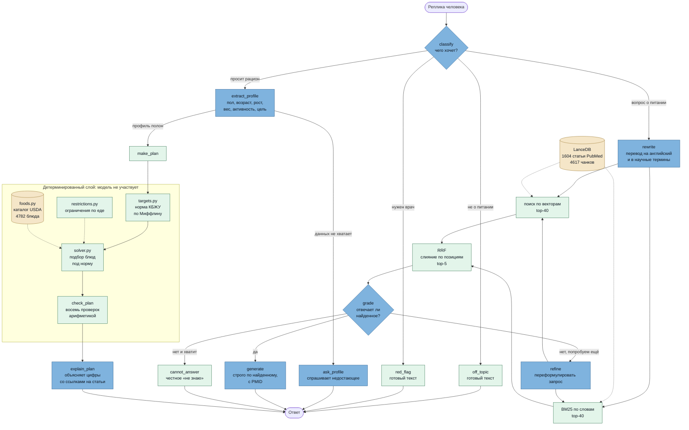

# Агент-нутрициолог

[](../../actions/workflows/tests.yml)

Разговорный ассистент, который считает персональную норму КБЖУ, собирает
рацион на день из справочника USDA и отвечает на вопросы о питании
со ссылками на научные статьи.

> ⚠️ Расчёты носят справочный характер и не заменяют консультацию врача
> или диетолога.

---

## Что он умеет

- **Считает норму** по уравнению Миффлина–Сан Жеора: спрашивает пол,
  возраст, рост, вес, активность и цель.
- **Собирает меню на день, неделю или месяц** — семь приёмов пищи в день
  с граммовкой и БЖУ, попадая в норму по калориям с точностью ±6%.
  Блюда не повторяются изо дня в день.
- **Предлагает только то, что можно приготовить**: блюда из продуктов,
  недоступных в России и СНГ, из подбора исключены.
- **Даёт скачать меню** книгой Excel с автофильтром и графиками.
- **Учитывает ограничения**: «не ем свинину», «без молочного».
- **Отвечает на вопросы о питании** по 1604 научным статьям со ссылками
  на источники (PMID).
- **Знает, когда отказаться.** При беременности, диабете, болезнях почек
  и расстройствах пищевого поведения рацион не выдаётся. На вопросы,
  ответа на которые в базе нет, агент говорит «не знаю», а не выдумывает.

**Ключевая особенность:** все числа считает код, а не языковая модель.
Модель понимает человека и объясняет результат, но калории не складывает.
Каждый план проходит восемь арифметических проверок.

---

## Как это устроено

Разговор идёт по графу LangGraph. Развилка одна и главная: **числа считает
код, объясняет модель.**



**Тёмно-голубые узлы** — там работает языковая модель: `classify`,
`extract_profile`, `ask_profile`, `explain_plan`, `rewrite`, `grade`,
`generate`, `refine`. Она понимает человека, оценивает найденное
и объясняет результат.

**Бледно-зелёные** — код без модели: расчёт нормы, подбор рациона, оба
поиска, слияние и готовые тексты отказов.

**Цилиндры** — хранилища. Их два, и это существенно: научные статьи
и каталог блюд не пересекаются, ветка вопросов и ветка рациона работают
с разными данными.

Узлы перечислены словами, а не только цветом: оттенок может не пережить
смену темы или отрисовщика, список — переживёт.

### Что здесь важно про поиск

Запрос **переводится на английский** до поиска: корпус англоязычный,
и по русскому запросу BM25 не находит ничего вовсе, а векторный поиск
работает вполсилы. Это единственный приём поиска, давший значимый
прирост (+0.100 recall, +0.154 MRR).

Дальше **два независимых поиска по одному индексу**: векторный ловит
смысл, BM25 — точные термины, названия и числа, где эмбеддинги плывут.
Каждый берёт по 40 кандидатов, и слияние идёт через **Reciprocal Rank
Fusion**: он сравнивает только позиции, поэтому косинусную близость
и BM25-score не нужно приводить к общей шкале. Из 80 кандидатов
остаётся 5.

Узел **`grade`** — единственное место, где система может сказать
«не знаю». Ретривер всегда возвращает ровно `k` фрагментов, даже когда
подходящего нет: у косинусной близости нет порога «не нашёл». Если
`grade` забраковал всё, запрос переформулируется и поиск повторяется;
если и это не помогло — честный отказ, а не пересказ мусора.

Ни одно число в ответе не приходит от модели. Норму считает `targets.py`,
рацион собирает `solver.py` жадным проходом и локальным поиском, состав
блюд берётся из справочника USDA как есть. Ручки `/targets`, `/plan`,
`/menu` к модели не обращаются вовсе и при одном `seed` дают один и тот же
ответ.

### Что во что превращается

Верхний ряд делается **один раз** и складывается на диск, нижний работает
**на каждый запрос**:

```
РАЗОВО (строит артефакты, требует ключей и денег)

  PubMed ──→ data_sources ──→ chunking ──→ embedder ──→ LanceDB
                                                         (4617 чанков)

  USDA ────→ data_sources ──→ foods ──→ translate_catalog ──→ foods.parquet
                                        review_catalog          (≈3000 блюд)
                                        review_familiar

НА КАЖДЫЙ ЗАПРОС

  реплика ──→ agent (граф) ─┬─→ retriever ──→ LanceDB ──→ ответ со ссылками
                            │
                            └─→ targets ──→ solver ──→ export ──→ Excel
                                (формулы)   (подбор)
```

Отсюда правило, объясняющее половину устройства проекта: **всё, что стоит
денег, сделано заранее**. В образ кладутся готовые каталог и индекс —
на запросе не строится ничего.

---

## Технологии

| Слой | Чем сделано |
|---|---|
| Язык, сборка | Python 3.12, uv (версии зафиксированы в `uv.lock`) |
| Граф диалога | LangGraph |
| Векторный поиск | LanceDB, `text-embedding-3-small` |
| Лексический поиск | BM25 своей реализации, слияние через RRF |
| Модели | OpenAI-совместимый API (polza.ai), опционально GigaChat |
| Сервис | FastAPI, uvicorn |
| Интерфейс | HTML и JavaScript без сборки и зависимостей |
| Выгрузка меню | openpyxl — книга Excel с графиками |
| Данные | USDA FNDDS (блюда), PubMed (научные абстракты) |
| Проверки | pytest (367 тестов, сеть не нужна), ruff, GitHub Actions |
| Запуск | Docker Compose |

---

## Быстрый старт

Понадобится Python 3.12+ (либо Docker) и ключ [polza.ai](https://polza.ai) —
доступ к моделям по OpenAI-совместимому API.

```bash
git clone <адрес-репозитория>
cd nutrition_agent

uv sync
cp .env.example .env        # и вписать POLZA_AI_API_KEY
```

Каталог блюд и справочник статей уже лежат в репозитории, но векторный
индекс надо собрать — он весит 44 МБ и в git не идёт:

```bash
python data_sources.py      # сырьё, ~30 МБ, бесплатно
python build_index.py       # векторный индекс
python check_setup.py       # проверка по слоям: что готово, чего нет
uvicorn api:app
```

Откройте **http://127.0.0.1:8000**. Документация API — на `/docs`.
Полная пересборка каталога с нуля описана в [data/README.md](data/README.md).

### В Docker

```bash
docker compose up --build
```

Индекс и каталог должны быть собраны заранее — они кладутся в образ
готовыми. Ключи передаются из `.env` на запуске и в образ не попадают.
Контейнер работает не от root, с файловой системой только на чтение.

---

## Как пользоваться

**Чтобы получить рацион**, просто расскажите о себе:

> Мне 31, женщина, рост 168, вес 74, сидячая работа, хочу похудеть

Агент задаст уточняющие вопросы, если чего-то не хватает, а потом покажет
норму, план на день и объяснит, откуда взялись цифры.

**Чтобы получить меню на несколько дней** — «…составь меню на неделю».
В ответ придёт один день как образец и кнопка «Скачать меню». В книге
три листа: сводка с графиками, таблица по приёмам пищи с автофильтром
и итоги по дням.

**Чтобы спросить про питание** — «Сколько белка нужно есть при похудении?»
Ответ будет со ссылками на статьи.

Если веб-интерфейс не нужен:

```bash
python demo.py              # диалог в терминале
python targets.py           # расчёт норм на нескольких профилях
python solver.py            # сборка рациона и результаты проверок
```

---

## API

| Ручка | Метод | Нужна LLM | Что делает |
|-------|-------|-----------|------------|
| `/` | GET | нет | веб-интерфейс |
| `/health` | GET | нет | готовность сервиса |
| `/targets` | POST | **нет** | норма КБЖУ по профилю |
| `/plan` | POST | **нет** | рацион на день + проверки |
| `/menu` | POST | **нет** | меню на 1-31 день |
| `/menu.xlsx` | POST | **нет** | то же меню книгой Excel |
| `/menu/{id}.xlsx` | GET | нет | скачать меню, собранное в разговоре |
| `/foods` | GET | нет | поиск по каталогу блюд |
| `/chat` | POST | да | реплика в разговоре |
| `/sessions/{id}` | DELETE | нет | забыть разговор |

Ручки `/targets` и `/plan` не обращаются к модели: ничего не стоят
и при одном `seed` дают один и тот же результат.

```bash
curl -X POST http://127.0.0.1:8000/targets \
  -H "Content-Type: application/json" \
  -d '{"sex":"female","age":31,"height_cm":168,"weight_kg":74,
       "activity":"sedentary","goal":"lose"}'
```

Задержка: `/targets` и `/foods` — около 75 мс, `/plan` — примерно полсекунды,
`/menu` на месяц — около 15 секунд. Время уходит не на модель, а на подбор
блюд: он линеен по числу дней.

---

## Проверки рациона

Каждый план проверяется арифметикой, без участия модели:

| Проверка | Условие |
|----------|---------|
| калорийность | в пределах ±6% от нормы |
| белок | не ниже −12% от нормы |
| жиры, углеводы | в пределах ±35% |
| клетчатка | не меньше 60% нормы |
| натрий | не выше 2300 мг |
| повторы | блюда в дне не повторяются |
| порции | от 30 до 600 г |

Результат виден в интерфейсе бейджами и возвращается в ответе `/plan`.

Отдельно работают предохранители, которые агент не может обойти: темп
снижения веса не выше 1% массы тела в неделю, калорийность не ниже
1200 ккал для женщин и 1500 для мужчин, белок не более 35% калорийности.
Если предохранитель сработал, об этом сообщается явно.

---

## Структура

Граница проходит по одному признаку: **нужен ли модуль работающему
сервису**. Её видно обходом импортов от `api.py` — одиннадцать модулей
нужны, остальные нет.

### Сервис

```
api.py               FastAPI: ручки и веб-интерфейс
agent.py             граф диалога на LangGraph
static/index.html    интерфейс

targets.py           нормы КБЖУ по Миффлину–Сан Жеору
solver.py            подбор рациона под норму
foods.py             каталог блюд
restrictions.py      пищевые ограничения
export.py            выгрузка меню в Excel

retriever.py         гибридный поиск: векторный + BM25
embedder.py          векторизация текста
lance_db.py          векторное хранилище
chunking.py          нарезка статей на фрагменты
data_preporation.py  подготовка корпуса

config.py            настройки и ключи
providers.py         клиенты моделей
gigachat_auth.py     авторизация GigaChat (опционально)
```

### Инструменты

В образ не попадают, для запуска не нужны.

```
data_sources.py       загрузка сырья USDA и PubMed
build_index.py        сборка векторного индекса
translate_catalog.py  перевод названий блюд
review_catalog.py     ревизия: доступность продуктов
review_familiar.py    ревизия: привычность блюда
translation_fixes.py  исправления перевода — единственный источник

evaluation.py         метрики поиска: precision, recall, MRR, NDCG
evaluation_answers.py метрики ответа: корректность, отказы
run_eval.py           прогон метрик по датасету
make_eval_dataset.py  сборка вопросов из корпуса
build_qrels.py        разметка релевантности пулом
diagnose_corpus.py    чего в корпусе не хватает
measurement.py        общая обвязка замеров

demo.py               диалог в терминале
check_setup.py        проверка готовности к запуску
```

### Папки со своим описанием

| Папка | О чём |
|---|---|
| [`experiments/`](experiments/README.md) | замеры: какой вопрос каждый решает и чем кончился |
| [`tests/`](tests/README.md) | 367 тестов и почему половина из них про данные |
| [`data/`](data/README.md) | источники, артефакты, порядок пересборки, ловушки |
| [`_research/`](_research/README.md) | журнал решений: почему каждая константа такая |

---

## Разработка

```bash
make help      # список команд
make check     # проверка готовности, без обращений к API
make test      # тесты, сети не требуют
make lint      # линтер
make run       # поднять сервис
make docker    # собрать образ и поднять контейнер
```

Замеры, на которых стоят решения, — отдельными целями; что они меряют
и чем кончились, описано в [experiments/README.md](experiments/README.md).

### Как вносить изменения

Общее правило: **правка проверяется тем же способом, каким принималось
исходное решение.**

| Хочу | Правлю | Проверяю |
|---|---|---|
| формулировки агента, маршрутизацию, отказы | промпты в `agent.py` | `make test`, затем прогон метрик |
| состав или объём рациона | `solver.py`, `targets.py` | `make solver` |
| добавить или убрать блюда | `foods.py`, `review_*.py` | `make solver` тоже: каталог — вход солвера |
| пищевое ограничение | `restrictions.py` | `pytest tests/test_restrictions.py` |
| перевод названия блюда | **только** `translation_fixes.py` | `pytest tests/test_translation_fixes.py` |
| расширить корпус | `data_sources.py`, затем `build_index.py` | `make metrics` и заново собрать разметку |
| промпт генерации ответа | `ANSWER_PROMPTS` в `agent.py` | `make answer-prompt` |
| интерфейс | `static/index.html` | `make run` и глазами |

Если правка про качество, порядок обратный привычному: сначала диагностика
по `_research/dataset/metrics.csv`, потом критерий приёмки числом **до**
прогона, и только потом сама правка. Подробнее — в
[experiments/README.md](experiments/README.md).

Тесты не ходят в сеть: провайдер модели подменён заглушкой. На свежем
клоне всё запускается сразу — без сборки данных и без ключей. То же самое
выполняется на GitHub при каждом пуше, см. `.github/workflows/tests.yml`.

Сменить провайдера генерации на GigaChat: укажите `GIGACHAT_API_KEY`
в `.env` и запустите с `LLM_PROVIDER=gigachat`.

---

## Лицензия и данные

Данные USDA FoodData Central находятся в общественном достоянии;
абстракты PubMed используются согласно условиям NCBI.
